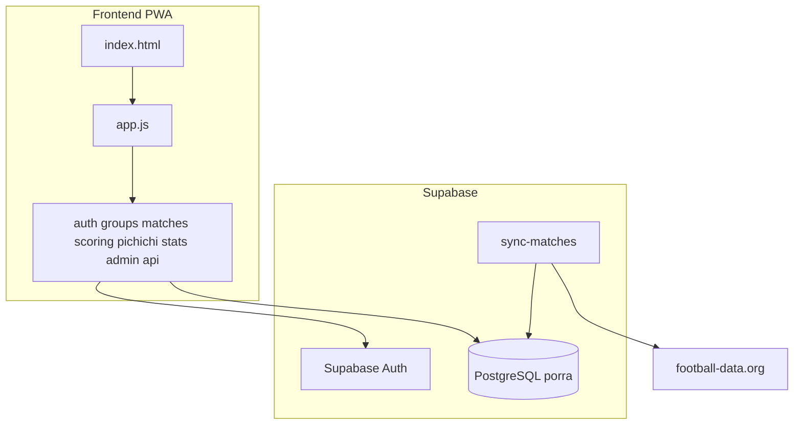

# RiesGol — Contexto del proyecto

## Resumen de la aplicación

**RiesGol** (también documentado como *ReisGol*) es una **aplicación web progresiva (PWA)** para organizar **porras privadas** de torneos internacionales de fútbol (Mundial, Eurocopa). Está pensada para grupos de amigos, oficina o familia que quieren competir entre sí durante un torneo.

La aplicación permite:

- **Autenticación** con Supabase Auth: registro, inicio de sesión y apodo personalizado.
- **Porras privadas**: cada usuario puede crear varias porras o unirse con un **código de 6 caracteres**. Soporta múltiples torneos y múltiples porras simultáneamente.
- **Apuestas 1-X-2** en cada partido del torneo, con cierre automático al inicio del encuentro.
- **Pichichi**: cada jugador elige **un equipo por grupo** del torneo; los goles de esos equipos suman puntos según su ranking FIFA y el multiplicador de fase.
- **Clasificación dinámica** calculada en el cliente (apuestas + Pichichi), con podio (1º, 2º, premio especial configurable y premio "último puesto").
- **Panel de administración** de porra: gestión de miembros, roles admin/member, estado del torneo y premio especial.
- **Estadísticas** de distribución de apuestas por partido y por usuario.

### Stack técnico

| Capa | Tecnología |
|------|------------|
| Frontend | HTML + CSS + JavaScript vanilla (SPA sin framework) |
| Backend / DB | Supabase (esquema PostgreSQL `porra`) |
| Autenticación | Supabase Auth |
| Datos externos | football-data.org vía Edge Function |
| PWA | `manifest.json` + `sw.js` (service worker) |

> **Nota:** La documentación en [`09-arquitectura.md`](09-arquitectura.md) describe una visión futura con Next.js y TypeScript, pero la implementación actual es JavaScript vanilla.

---

## Arquitectura general



### Flujo principal de usuario

1. Carga → `auth.js` comprueba la sesión.
2. Login correcto → `groups.js` carga las porras del usuario → vista "Mis Porras".
3. El usuario selecciona una porra → `Groups.currentGroupId` y `currentTournamentId` se guardan en memoria y `localStorage`.
4. Navegación SPA (`navigateTo`) dispara el cargador de cada vista:
   - **Clasificación** → `scoring.loadRanking()`
   - **Partidos** → `matches.loadMatches()`
   - **Pichichi** → `pichichi.loadPichichiData()`
   - **Estadísticas** → `stats.loadStats()`
   - **Admin** → `Admin.*`
5. Las apuestas se escriben directamente en `porra.bets` vía `supabaseClient`.
6. La sincronización de partidos la realiza la Edge Function `sync-matches` (cron o manual) consultando football-data.org.

### Orden de carga de scripts

Definido en [`index.html`](../index.html):

```
CDN @supabase/supabase-js
  → supabase.js
  → app.js
  → auth.js
  → api.js
  → groups.js
  → admin.js
  → scoring.js
  → matches.js
  → pichichi.js
  → stats.js
  → opciones.js
```

### Modelo de datos (esquema `porra`)

```
auth.users
    └── porra.users (perfil: name)
            ├── group_members (role: admin|member)
            │       └── groups (porra: codigo, special_prize_*)
            │               └── tournaments (estado: draft|active|finished)
            ├── bets (user_id + match_id + group_id + prediccion)
            └── favorite_selections (user_id + group_id + bombo + equipo_id)

porra.teams (nombre, puntos_fifa, grupo)
porra.matches (tournament_id, fase, goles, estado, external_api_id, ...)
porra.team_aliases (api_name → team_id)
```

La puntuación se calcula en tiempo real en el cliente; no se almacena en la base de datos.

---

## Inventario de ficheros

### Raíz

| Fichero | Descripción |
|---------|-------------|
| [`index.html`](../index.html) | Punto de entrada de la SPA. Define todas las vistas (login, porras, clasificación, partidos, Pichichi, admin, opciones), la barra de navegación y la carga de scripts JS. |
| [`manifest.json`](../manifest.json) | Manifiesto PWA: nombre de la app, colores de tema, iconos y `start_url` para instalación en dispositivos. |
| [`sw.js`](../sw.js) | Service worker que cachea HTML, CSS, JS y fuentes para uso offline parcial con estrategia cache-first. |
| [`supabase_schema.sql`](../supabase_schema.sql) | Esquema SQL inicial/MVP (users, teams, matches, bets, pichichi_teams). **Desactualizado** respecto al modelo 2.0 definido en `docs/project_sql.txt`. |
| [`walkthrough.md`](../walkthrough.md) | Guía de configuración: lógica Pichichi por grupos, pasos para API-Sports y sincronización vía Edge Functions. |
| [`implementation_plan.md`](../implementation_plan.md) | Plan de implementación Fase 2: cambios de Pichichi, podio, integración con API externa y preguntas abiertas de diseño. |

### `css/`

| Fichero | Descripción |
|---------|-------------|
| [`css/styles.css`](../css/styles.css) | Hoja de estilos principal: tema oscuro con glassmorphism, navbar, tarjetas de partidos, podio, tablas, formularios, responsive y componentes de porras/apuestas. |

### `js/`

Los módulos se comunican mediante objetos globales en `window`.

| Fichero | Descripción |
|---------|-------------|
| [`js/supabase.js`](../js/supabase.js) | Inicializa el cliente Supabase con URL, anon key y esquema `porra`. Expone `window.supabaseClient`. |
| [`js/app.js`](../js/app.js) | Núcleo de la SPA: `initApp()`, enrutamiento `navigateTo()`, overlay de carga, menú móvil y registro del service worker. |
| [`js/auth.js`](../js/auth.js) | Login y registro, sesión persistente, creación de perfil en `porra.users`, logout. Expone `window.getCurrentUser()`. |
| [`js/api.js`](../js/api.js) | Capa de acceso a datos: CRUD de torneos, partidos, equipos, porras y miembros; caché en memoria. Expone `window.apiClient`. |
| [`js/groups.js`](../js/groups.js) | Gestión de porras: listar, filtrar, crear, unirse por código y mantener la porra activa en `localStorage`. Expone `window.Groups`. |
| [`js/scoring.js`](../js/scoring.js) | Calcula y renderiza la clasificación: puntos de apuestas + Pichichi, podio y tablas separadas. Expone `window.loadRanking`. |
| [`js/matches.js`](../js/matches.js) | Vista de partidos: agrupa por fase, tarjetas de apuesta 1-X-2, traducción de nombres de equipos. Expone `window.loadMatches`. |
| [`js/pichichi.js`](../js/pichichi.js) | Selección de equipos Pichichi (uno por grupo), tabla de valor de gol y guardado en `favorite_selections`. Expone `window.loadPichichiData`. |
| [`js/stats.js`](../js/stats.js) | Estadísticas de apuestas por fase, usuario y partido (distribución 1/X/2 con nombres). Expone `window.loadStats`. |
| [`js/admin.js`](../js/admin.js) | Panel de administración: miembros, promover/degradar roles, premio especial y estado del torneo. Expone `window.Admin`. |
| [`js/opciones.js`](../js/opciones.js) | Vista de opciones de cuenta: cambio de apodo y cierre de sesión. |
| [`js/flags.js`](../js/flags.js) | Utilidad `window.getFlag(teamName)` para emojis de banderas. **No se carga en `index.html`** (solo aparece en la caché del service worker). |

### `supabase/`

| Fichero | Descripción |
|---------|-------------|
| [`supabase/functions/sync-matches/index.ts`](../supabase/functions/sync-matches/index.ts) | Edge Function en Deno: recibe `tournamentId`, consulta football-data.org, mapea equipos y hace upsert en `porra.matches` (resultado a 90 minutos, prórroga/penaltis informativos). |

### `docs/`

Documentación de producto, reglas de negocio y modelo de datos.

| Fichero | Descripción |
|---------|-------------|
| [`docs/00-vision.md`](00-vision.md) | Visión del producto: porras privadas para Mundial/Euro, multiporra y multitorneo. |
| [`docs/01-producto.md`](01-producto.md) | Conceptos fundamentales: usuario, torneo, porra, partido, apuesta, favoritos y Pichichi. |
| [`docs/02-usuarios-y-roles.md`](02-usuarios-y-roles.md) | Roles member y admin, y sus permisos dentro de una porra. |
| [`docs/03-flujos.md`](03-flujos.md) | Flujos de experiencia de usuario: registro, crear/unirse a porra, selección de favoritos. |
| [`docs/04-reglas-negocio.md`](04-reglas-negocio.md) | Reglas de negocio: alias únicos, restricciones de alta, empates e históricos. |
| [`docs/05-sistema-apuestas.md`](05-sistema-apuestas.md) | Reglas del sistema de apuestas 1-X-2: cierre al inicio, solo 90 minutos, penalización por no apostar. |
| [`docs/06-sistema-puntuacion.md`](06-sistema-puntuacion.md) | Fórmulas de puntuación: puntos = fallos de otros × multiplicador de fase; total = apuestas + Pichichi. |
| [`docs/07-favoritos-y-pichichi.md`](07-favoritos-y-pichichi.md) | Selección por bombos/grupos, factor FIFA, multiplicadores de fase y cálculo dinámico de goles. |
| [`docs/08-experiencia-usuario.md`](08-experiencia-usuario.md) | Wireframes conceptuales: Mis Porras, podio, clasificaciones, apuestas y estadísticas. |
| [`docs/09-arquitectura.md`](09-arquitectura.md) | Arquitectura objetivo: Supabase, esquema `porra` y principios de multiporra. |
| [`docs/10-modelo-datos.md`](10-modelo-datos.md) | Tablas actuales y filosofía de puntuación calculada (no almacenada en DB). |
| [`docs/11-edge-functions.md`](11-edge-functions.md) | Especificación de `sync_matches_v2`: flujo, `tournamentId` y `team_aliases`. |
| [`docs/12-roadmap.md`](12-roadmap.md) | Roadmap por fases: tournaments → groups → migraciones → admin → stats → históricos. |
| [`docs/13-project-rules.md`](13-project-rules.md) | Reglas de desarrollo para agentes: TypeScript, sin IDs hardcodeados, siempre `group_id`/`tournament_id`. |
| [`docs/project_sql.txt`](project_sql.txt) | Migración completa ReisGol 2.0: tournaments, groups, group_members, team_aliases, bets/favorite_selections con `group_id`, índices y RLS. |
| [`docs/insert_tournament.sql`](insert_tournament.sql) | Script de inserción del torneo Mundial 2026 (`external_code = 'WC'`). |
| [`docs/sample_data.sql`](sample_data.sql) | Datos ficticios de prueba: usuarios, apuestas y selecciones Pichichi. |
| [`docs/CONTEXT.md`](CONTEXT.md) | Este archivo: mapa de contexto del repositorio con resumen de la app e inventario de ficheros. |

---

## Referencias y deuda técnica

Puntos relevantes para quien explore el código:

- **Iconos PWA** (`assets/icon-192.png`, `assets/icon-512.png`) referenciados en `manifest.json` e `index.html`, pero la carpeta `assets/` está vacía o no existe.
- **Esquema SQL desalineado**: `supabase_schema.sql` en la raíz es el MVP antiguo; el código actual usa el modelo 2.0 de `docs/project_sql.txt` (tournaments, groups, `favorite_selections` con `group_id`).
- **`flags.js` huérfano**: no se incluye en `index.html`, aunque el service worker lo cachea.
- **Vista `stats-view`**: referenciada en la navbar y manejada en `app.js`, pero no existe un `<section id="stats-view">` dedicado en `index.html` (el contenedor `#stats-container` está dentro de `pichichi-view`).
- **`groups.js`**: usa `window.app.navigateTo` y `window.app.loadDashboard`, pero `app.js` expone `window.navigateTo` y `scoring.js` expone `window.loadRanking` (no `loadDashboard`). La navegación desde tarjetas de porra puede fallar.
- **Traducciones de equipos** duplicadas en `matches.js` y `stats.js`; los docs proponen `team_aliases` en DB para centralizarlas.
- **No existe README** en la raíz del proyecto.
